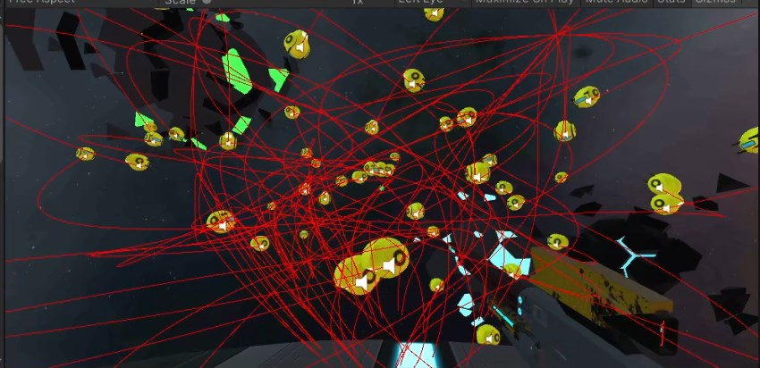

# Prototipo II

## Descripción
Nuestro juego space drone consiste en disparar a drones que tienen un movimiento que sigue un camino aleatorio para eliminarlos. El juego cuenta con varios niveles en los que el número de drones y su velocidad va aumentando. Se ha tenido en cuenta el hecho de que se desarrolla para realidad virtual, haciendo uso de una mira, poniendo un fondo 360 grados y haciendo que el usuario no tenga que realizar movimientos bruscos de la cabeza para evitar mareos.

## Cuestiones importantes para su uso
Tener en cuenta que este juego ha sido desarrollado para realidad virtual en android. Se necesita un mando con bluetooth para poder controlarlo en android. El resto es muy intuitivo, tenemos una menu donde solo tenemos dos opciones, una es la de jugar y la otra salir de la aplicacion. En el modo de juego podemos acceder siempre al menu con la tecla esc del teclado o con la tecla menu del mando de xBox. Disparar podemos con el el raton (tecla izquierda), o con la tecla A del mando de xBox.

Tenemos que tener en cuenta que los drones reciben datos sobre el microfono. esto significa que, cuando ellos estan cerca, y el usuario hace ruidos fuertes, los drones pueden saber la posicion del usuario y atacarlo. Pero en esta primera version el usuario tiene armadura muy fuerte y no puede morir por lo cual los drones se suicidadan en el intento.

## Hitos de programación logrados relacionándolos con los contenidos que se han impartido

### Interacción entre objetos. Eventos
- Las balas al impactar con algún enemigo le quitan vida a este y si la vida les baja a cero explotan y se destruyen. Además cuando la bala - impacta se hace notar con unas partículas de impacto en el enemigo.
- Si el usuario realiza algún sonido fuerte los enemigos se lanzaran asi él y explota
- Existe un game controller que se comunica con varios objetos del juego y que los mismos se comunican con él. Por ejemplo, el game  controller puede decirle al menú de pausa que pare o continúe el juego, los enemigos notifican de su muerte, el game controller controla el número de enemigos y el nivel,etc
- Usamos linecast para notificar cuando atraviesan las balas al enemigo
- Utilizamos el nuevo sistema de input de Unity para mapear los botones del mando (además del teclado) para poder controlarlo en la versión android

### Multimodalidad
- Existe para la versión de Windows un reconocedor de palabras clave por voz. Podemos pausar y continuar el juego usando las palabras clave: Pause y Resume.
- Incorporamos un gps que nos indica la localización en la que estemos situados, podemos verla debajo del título del juego en el menú de pausa.
- Si el usuario hace un sonido fuerte los drones vienen hacia el usuario, esto también se consigue usando el microfono.
- Uso de sensores por parte de la integración con Google Cardboard, también se recogen los datos en un script para posibles nuevas funcionalidades.

### Aspectos destacables de la implementación
Sin duda lo más destacable y complejo ha sido la implementación de los caminos a seguir por los drones. Se ha utilizado Bezier Curves y Catmull Rom Spline generando los mismos a partir de puntos creados para este proposito, dando asi mas control de donde viajan los drones pero permitiendo al mismo tiempo un movimiento pseudo aleatorio. Además la comunicación a través de varios ficheros teniendo en cuenta la cantidad de los mismos ha sido compleja.

Para dar una idea de la cantidad de posibles caminos que pueden tomar los drones hemos creado 50 de los mismos y dejando que dibujen su camino:

## Descripción de archivos

**Todos los archivos se pueden encontrar en la carpeta AllScripts**

Tambien es importante la asignacion de los mismos ficheros a los distintos objetos en unity para que funciona correctamente, pero para dar una idea inicial de que estan haciendo los ficheros:

- **Userinput:** implementa las funciones del menú y escucha tanto a los botones del mando como a las teclas del teclado como a los comandos del game controller.
- **userinputDefinition:** especifica que valores se asocian a que acción
- **gun:** se encarga de disparar es decir de crear las instancias de las balas y asignarles un determinado daño
- **bullet:** contiene las especificaciones necesarias de la bala daño, posición, velocidad.
- **enemy:** es el script basico para controlar las funcines y vida del enemigo (drones)
- **GameLogicController:** establece el estado del juego y se comunica con el menú
- **playercontrols:** es el fichero génerado por Unity input en el que se establece el mapeado de botones y teclas
- **DrawGizmoForCatmullRomSpline:** se encarga de dibujar (gizmo) las líneas de la trayectoria del catmullromspline
- **DrawGizmoForBezierCurve:** se encarga de dibujar (gizmo) las líneas de la trayectoria del bezier curve
- **BasicUtilitiesForAllScripts:** funciones que utilizan varios scripts y no tienen datos propios de guardar
- **BezierCurveUtilities:** basicamente la formula para calcular la posicion de la curva de bezier
- **CatmullRomSplineUtilities:** los metodos para implementar la formula de los Catmull Rom Splines
- **MoveAlongPath:** clase base para herencia de los clases MoveAlong...
- **MoveAlongBezierCurve:** este script mueve el objeto con respecto a las curvas de bezier calculado
- **MoveAlongCatmullRomSpline:** este script mueve el objeto a lo largo de las lineas de Catmull Rom
- **GameObjectSearcher:** clase como utilidad para encontrar un gameobject especifico que necesitemos
- **ButtonOnClickEvents:** script para implementar funciones para la interaccion con los botones
- **changeColorWhenLooking:** es un script para pointer events (solo para debugging de los cardboard pointers)
- **InGameComunicationCodes:** es un script que contiene variables de definicion de que estado o mensaje es enviado con que codigo
- **KeywordVoiceControl:** permite interactuar con la interfaz a traves de la voz (solo funciona en windows)
- **LevelData:** contiene las descripciones de los diferentes niveles del juego
- **MicrophoneInputControler:** escucha al microfono y envia un mensaje a los drones cuando el usuario hace demasiado ruido
- **UserCharacter:** tiene los script asociados al usuario fisico dentro del juego
- **UserSensorData:** contiene el codigo necesario para obtener los datos de los sensores como gps, accelerometro, etc

## Acta de trabajo en equipo

### Thaddaus
- Plataforma donde se mueve el usuario
- Implementación del micrófono
- Movimiento del enemigo hacia el usuario
- Camino a seguir por el enemigo
- Game controller
- Implementación GPS

### Adrián
- User input métodos
- Imagen 360 para el diseño y el horizonte
- Sonidos del juego
- Arma del usuario
- Balas

### Equipo
- Reconocedor de palabras clave
- Drones (enemigos)
- Usuario (cámera) con Google Cardboard
- Interfaz de usuario

Hemos utilizado github projects para organizar las tareas y hemos trabajo por las tardes comunicandonos con google meet.

### Gif animado de ejecución

En el siguiente gif podemos ver como es el juego en ejecucion:

